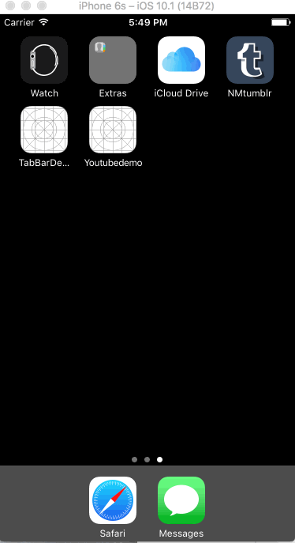

# NMtumblr

The purpose of this homework is to leverage animations and gestures to create custom navigation. We're going to use the techniques from this week to implement some interactions in Tumblr.

Time spent: `<8>`

### Features

#### Required

- [ ] Tapping on Home, Search, Account, or Trending should show the respective screen and highlight the tab bar button.
- [ ] Compose button should modally present the compose screen.

#### Optional

- [ ] Compose screen is faded in while the buttons animate in.
- [ ] Login button should show animate the login form over the view controller.
- [ ] Discover bubble should bob up and down unless the SearchViewController is tapped.

#### The following **additional** features are implemented:

- [ ] List anything else that you can get done to improve the app functionality!

Please list two areas of the assignment you'd like to **discuss further with your peers** during the next class (examples include better ways to implement something, how to extend your app in certain ways, etc):

1. the animation example on assignment page looks a bit different than the instructions for the assignment
2. NA

### Video Walkthrough 

Here's a walkthrough of implemented user stories:

GIF created with [LiceCap](http://www.cockos.com/licecap/).

## Notes

Describe any challenges encountered while building the app. - had issues with animating loading on search view controller

* stackoverflow
